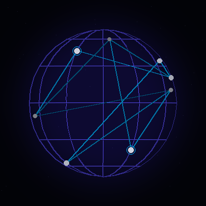

<!--Banner-->

  

<!--Terminal Animation-->

  

  

---

### About

<table>
<tr>
<td width="30%" align="center" valign="top">

</td>
<td width="70%" valign="top">

I am a 2x founder and Computer Science graduate specializing in cybersecurity, AI/ML, intelligent automation, and secure systems engineering. I build edge AI systems, IoT ecosystems, intrusion detection platforms, LLM powered pipelines, computer vision surveillance systems, and backend APIs.

<blockquote>Bridging neural network research with production grade software and rugged hardware.</blockquote>

</td>
</tr>
</table>

- Founder and CEO of Qararix, a SYSaaS and SaaS cybersecurity venture.
- Building HISN, a CTI based Intrusion Detection and Prevention System, and SentriQ, a remote laptop security platform. Both ranked Top 10 in Accelerate Punjab (PITB).
- Working across AI/ML, NLP, computer vision, generative AI, and LLM pipelines, ranging from Vision Transformers to Stable Diffusion.
- Shipping Android and IoT companion apps alongside Ethereum smart contracts and cybersecurity products.
- Strong foundation in networking (TCP/IP, UDP, CIDR), cyber defense, and cloud native deployment.
- BS Computer Science, KICSIT (IST Islamabad), 2022 to 2026.
- Portfolio: [qasimzuberi.vercel.app](https://qasimzuberi.vercel.app/)

<strong>Full experience and education</strong>

 

**Qararix, Founder and CEO (2026 to Present)**
Founded a SYSaaS and SaaS cybersecurity venture delivering CTI based defense platforms, secure IoT ecosystems, and AI driven threat detection as subscription services. Architected multi-tenant SaaS backend infrastructure with Django, PostgreSQL, Docker, and CI/CD pipelines, and managed 50+ client and internal projects end to end.

**NASTP Alpha, Automation Specialist (Sep 2025 to Present)**
Developed Python based automation workflows and intelligent monitoring systems, including log analysis and workflow orchestration pipelines for operational environments.

**Devrolin, Automation Engineer (Sep 2025 to Feb 2026)**
Built Python automation tools for log processing and data pipeline orchestration, integrating automation scripts into CI/CD ready development workflows.

**Education**
BS Computer Science, KICSIT (IST Islamabad), 2022 to 2026. Coursework in Artificial Intelligence, Machine Learning, Deep Learning, Computer Networks, Software Engineering, Database Systems, Operating Systems, Cybersecurity, Visual Programming, and Blockchain.

---

### Tech Stack

---

### Current Focus

- Deepening work on Vision Transformers and generative AI, including Stable Diffusion and Diffusers.
- Scaling Qararix's multi-tenant SaaS infrastructure with Docker and CI/CD pipelines.
- Exploring Solidity and smart contract security patterns in more depth.

### Recent Milestones

- Ranked Top 10 in Accelerate Punjab (PITB) for HISN's innovation in AI driven cyber defense.
- Shipped SentriQ, a real time remote laptop security and anti-intrusion platform.
- Built NeuralAge, a Stable Diffusion powered facial aging research platform.

---

### Projects

**Cybersecurity and Security Products**
- [HISN](https://github.com/itx-zuberi/hisn), CTI based Intrusion Detection and Prevention System
- [SentriQ](https://github.com/itx-zuberi/sentriq), remote laptop security and anti-intrusion platform

**AI, Machine Learning, and Computer Vision**
- [NeuralAge](https://github.com/itx-zuberi/neuralage), region-aware facial aging research platform
- [AI-Powered Retail Surveillance System](https://github.com/itx-zuberi/retail-surveillance-system), hybrid suspicious activity detection
- [Stroke Risk Prediction Dashboard](https://github.com/itx-zuberi/stroke-risk-prediction), clinical risk scoring served through a live dashboard
- [Multi-Step Sales Forecasting](https://github.com/itx-zuberi/sales-forecasting-deep-learning), deep sequence model benchmarking

**Mobile and IoT Systems**
- [MedicalZone](https://github.com/itx-zuberi/medicalzone), multi-role healthcare Android application
- [Child Safety Band](https://github.com/itx-zuberi/child-safety-band), wearable companion app
- [HuMotion](https://github.com/itx-zuberi/humotion), AI-powered smart prosthetic arm
- [SheSafe by Qararix](https://github.com/itx-zuberi/shesafebyqararix), women's safety system

**Web, Backend, and Full-Stack**
- [AI Document Summarizer](https://github.com/itx-zuberi/ai-document-summarizer), self-hosted privacy-friendly summarization microservice
- [Animora Nexus](https://github.com/itx-zuberi/animora-nexus), anime catalogue management system

**Blockchain**
- [Ethereum Smart Contract Suite and MetaMask Dashboards](https://github.com/itx-zuberi/ethereum-smart-contracts)

Each repository README includes full project details and a contact section for source code access.

---

### GitHub Snapshot

  

  

  

---

### Connect

Rawalpindi, Pakistan &nbsp;|&nbsp; +92 333 8971343

  

